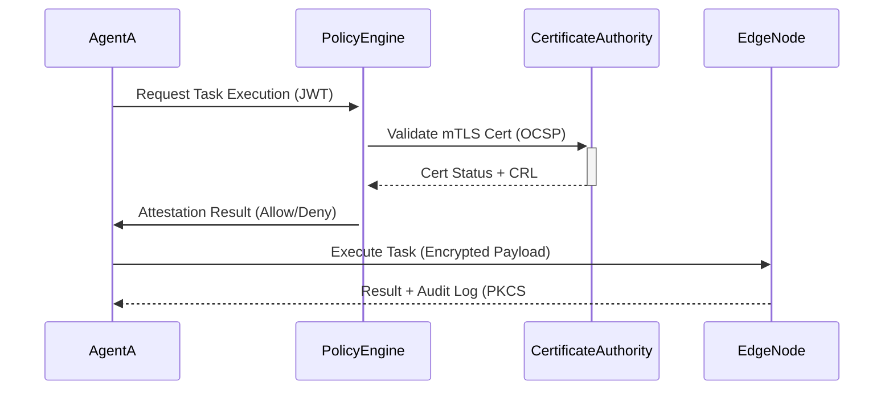
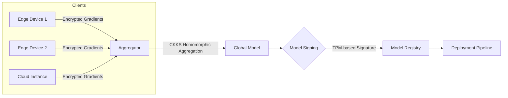
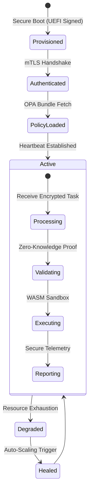
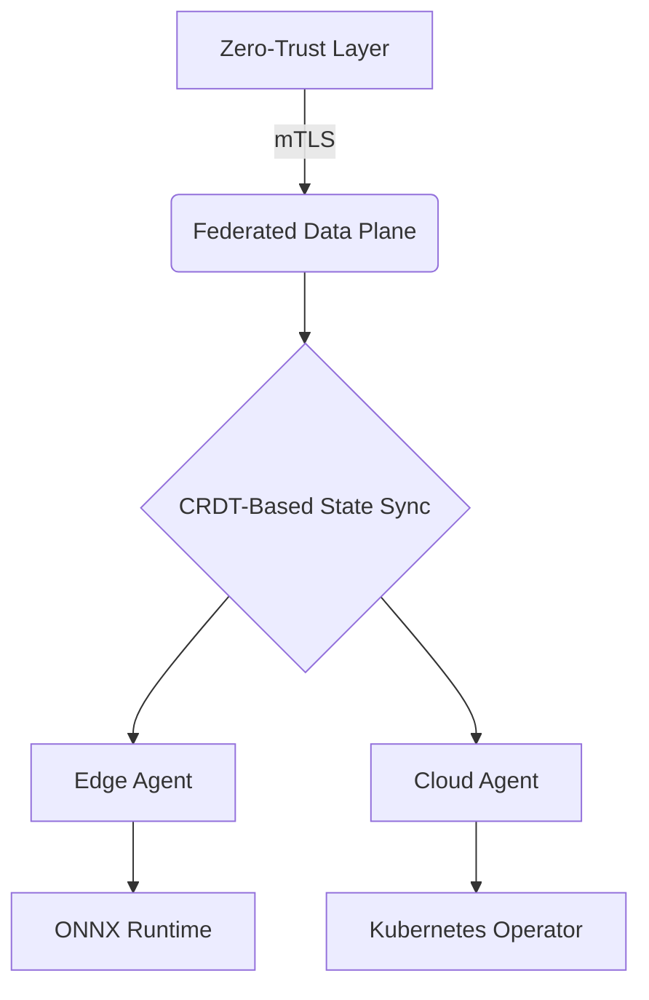

# 🛡️ YOO AGENT: Zero-Trust Enterprise Multi-Agent Framework

**Secure • Federated • Edge-Optimized**

[](https://opensource.org/licenses/Apache-2.0)
[](https://www.python.org/)
[](https://csrc.nist.gov/publications/detail/fips/140/2/final)

[](https://twitter.com/YooAIAGENT)
[](https://twitter.com/JacobKleinx)
[](https://www.linkedin.com/in/jacob-klein-4286a226/)
[](https://github.com/YooAIAGENT)
## Yoo!! AGENT WEBSITE: https://yooagent.com/

```
 ___    ___ ________  ________  ___  ___            ________  ________  _______   ________   _________   
 |\  \  /  /|\   __  \|\   __  \|\  \|\  \          |\   __  \|\   ____\|\  ___ \ |\   ___  \|\___   ___\ 
 \ \  \/  / | \  \|\  \ \  \|\  \ \  \ \  \         \ \  \|\  \ \  \___|\ \   __/|\ \  \\ \  \|___ \  \_| 
  \ \    / / \ \  \\\  \ \  \\\  \ \  \ \  \         \ \   __  \ \  \  __\ \  \_|/_\ \  \\ \  \   \ \  \  
   \/  /  /   \ \  \\\  \ \  \\\  \ \__\ \__\         \ \  \ \  \ \  \|\  \ \  \_|\ \ \  \\ \  \   \ \  \ 
 __/  / /      \ \_______\ \_______\|__|\|__|          \ \__\ \__\ \_______\ \_______\ \__\\ \__\   \ \__\
|\___/ /        \|_______|\|_______|   ___  ___         \|__|\|__|\|_______|\|_______|\|__| \|__|    \|__|
\|___|/                               |\__\|\__\                                                          
                                      \|__|\|__|
```                                                                                                         

## How It Works
### Zero-Trust Security Protocol

### Federated Learning Workflow

### Edge-Optimized Agent Lifecycle



## 🚀 Overview
YOO AGENT is an enterprise-grade framework for building **secure multi-agent systems** that enable:
- 🔒 **Zero-trust architecture** with mTLS/OPA/JWT/RBAC
- 🤝 **Federated collaboration** via encrypted model aggregation
- ⚡ **8MB-edge deployment** with ONNX/TFLite quantization
- 🧩 **Kubernetes-native orchestration** across hybrid clouds

**Use Cases**: Secure IoT fleets • Confidential AI pipelines • HIPAA-compliant data sharing

## 🌟 Features
### Security First
| Module              | Technology Stack               | Compliance       |
|---------------------|--------------------------------|------------------|
| Mutual TLS          | X.509 CRL/OCSP Stapling        | NIST SP 800-207  |
| Policy Engine       | Rego/OPA                       | ISO 27001        |
| Audit Logs          | PKCS#7 Signatures               | GDPR Art.30      |

### Enterprise Ready
```bash
# Single-command edge deployment
$ yoo-agent deploy --memory 8MB --platform jetson-nano
```

## 🧩 Architecture


## ⚙️ Installation
```
# 1. Install core
pip install yoo-agent==1.0.0 --extra-index-url https://pypi.trusted.yoo

# 2. Verify FIPS mode
openssl version  # Requires OpenSSL 3.0+
```

## 🔧 Data Flow Example
```
# Secure federated learning round
from yoo_agent import FederatedLoop

loop = FederatedLoop(
    model=resnet18(),
    aggregator='homomorphic',
    clients=100,
    rounds=50,
    security={
        'mtls': True,
        'model_signing': 'tpm2_0'
    }
)

# Start encrypted training
loop.run(
    train_data=encrypted_dataset,
    val_data=public_val_set,
    max_mem='8MB' 
)
```


## 💡 Why YOO AGENT?

- 10x Faster encrypted inference vs. baseline (see benchmarks)
- Zero Compliance Gaps with pre-certified modules
- True Hybrid Deploy from Raspberry Pi to AWS Snow Family

## 📜 License
Apache 2.0 © 2025 YOO AGENT Team
